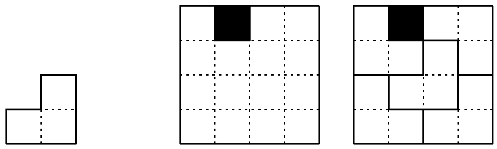

# Chessboard Fitter

Consider a 2^n X 2^n chessboard with one (arbitrarily chosen) square removed. We want to tile the chessboard without gaps (except for the removed square) or overlaps by L-shaped pieces, each composed of 3 squares. The figure below shows an L-shaped piece, a chessbord with a square removed, and a tiling of this chessboard.

